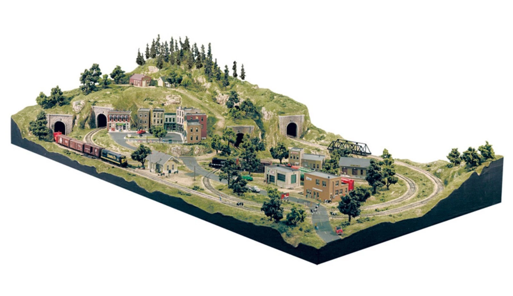

# Assignment — Small Town Environment (Foundational Kit)

## Objective

Construct a complete, small-scale town environment using foundational blocks and large blocks.

The environment must be:
- Playable
- Readable
- Efficient
- Reusable

> Think: a **train set** — contained, mechanical, and intentional.

---

## Reference Structure

All work must follow the SDK structure and reference existing kits:

- prototyping-objects
- testing-objects
- testing-objects-contraptions
- testing-objects-spawns

> If unsure how to build something, find the closest example and follow it.

---

## Design Principle

> We are not decorating. We are constructing systems.

Every structure must:
- Serve gameplay space
- Define movement or sightlines
- Be reusable in other environments

---

# Work Order

> NOTE: Each category can be a separate Kit / Mod. [Remember Fallout's Kit design strategies.](https://www.youtube.com/watch?v=QBAM27YbKZg)
> Watch or listen to the above video at least once this week.
---

## 1. Terrain & Landform

### Required
- Base terrain mass (contained land chunk)
- Elevated hill / ridge
- Cutouts for roads and structures

### Design Notes
- Shape defines gameplay before assets do
- Elevation creates advantage and visibility
- Containment prevents scope creep

> Example: The hill and tunnels in the reference image create vertical layering and controlled paths.

---

## 2. Road System

### Required
- Main road loop
- Secondary branching roads
- Intersections (T and 4-way)
- Entry / exit points

### Design Notes
- Roads define player flow
- Intersections create decision points
- Loops prevent dead gameplay

> Example: The circular rail/road system ensures continuous traversal.

---

## 3. Residential Zone

### Required
- Small houses (1-story)
- Medium houses (2-story)
- Small Apartment Building
- Damaged variants

### Design Notes
- Variation is achieved through reuse, not uniqueness
- Buildings define cover and spacing
- Avoid over-detailing — structure first

---

## 4. Civic Structures

### Required
- Police station
- Clinic / medical building
- Town office

### Design Notes
- These act as natural gameplay anchors
- Recognizable shapes improve navigation
- Central placement increases relevance

---

## 5. Commercial Zone

### Required
- Supermarket
- Hardware store
- Electronics shop (RadioShack-inspired)
- General small shop

### Design Notes
- Larger footprints create interior gameplay space
- Distinct silhouettes aid orientation
- Grouping creates logical zones

> Function first: these are resource hubs, not decoration.

---

## 6. Industrial / Utility

### Required
- Warehouse
- Storage structures

### Design Notes
- Large shapes break repetition
- Open interiors support flexible gameplay
- Simplicity improves performance

---

## 7. Ground-Zero / Event Area

### Required
- One major disrupted zone:
  - Warzone
  - Explosion site
  - Overrun checkpoint

### Design Notes
- This defines the identity of the town
- Damage creates asymmetry and interest
- Should alter traversal and line-of-sight

> This answers: “What happened here?”

---

## 8. Open Areas

### Required
- Empty lots
- Parking areas
- Small fields

### Design Notes
- Space is gameplay
- Open areas enable encounters
- Not every space should be filled

---

## 9. Structural Block System

### Required
- Walls (multiple sizes)
- Floors / ceilings
- Roofs
- Corners (inner/outer)
- Door frames
- Window frames

### Design Notes
- Everything builds from this
- Precision matters more than detail
- Grid alignment is non-negotiable

---

## 10. Terrain Materials

### Required
- Grass
- Dirt
- Worn ground
- Asphalt
- Concrete

### Design Notes
- Use tiling, not unique UVs
- Variation through repetition and blending
- Keep textures lightweight

---

## 11. Damage States

### Required
- Intact
- Worn
- Destroyed variants (where applicable)

### Design Notes
- Reuse base assets
- Damage adds story without new systems
- Avoid creating entirely new meshes unless necessary

---

# Performance & Efficiency Guidelines

- Prefer tiling textures over unique UV maps
- Keep texture usage minimal and reusable
- Use flat colors where possible
- Let materials do the work, not textures

> Efficiency is a design choice, not a limitation.

---

# Structural Discipline

- All assets must align to grid
- No offsets, no guesswork
- Reuse before creating new

> If it doesn’t snap cleanly, it doesn’t belong.

---

# Final Principle

> Build a system that can create towns — not just one town.

---

# Reference

## Reference

Use this as a visual reference for:
- Contained design
- Clear structure
- Functional layout
- Mechanical readability

> If your town feels like a model set — you’re doing it right.

# Texture & Efficiency Guidelines

## Core Principle

> Build for efficiency first. Detail is added only when necessary.

---

## Tiling Over Unique UV Mapping

- Prefer **tiling textures** over uniquely unwrapped UVs
- Use UV mapping only when:
  - The asset requires unique detail
  - Tiling cannot achieve the desired result

### Why

- Faster to produce
- Smaller file sizes
- Consistent visual style
- Easier to reuse across assets

> If a surface repeats, the texture should repeat.

---

## Keep Overhead Low

- Favor:
  - Flat colors
  - Simple materials
  - Reusable textures

- Avoid:
  - Large unique texture maps
  - High-resolution textures for basic surfaces
  - One-off textures for single assets

> Most surfaces do not need unique detail.

---

## Use Materials Intelligently

- Use Godot materials to:
  - Control tiling and scale
  - Adjust color and variation
  - Reuse the same texture across multiple assets

- Avoid:
  - Duplicating textures for minor differences
  - Baking detail that can be handled by materials

> Let the engine do the work whenever possible.

---

## Practical Rule

Before creating a new texture, ask:

- Can this be tiled?
- Can this be reused?
- Can this be achieved with a material instead?

If yes — do not create a new texture.

---

## Final Reminder

> Efficiency is not a restriction — it is a design discipline.

Smaller, cleaner assets:
- Load faster
- Perform better
- Scale across the entire project
